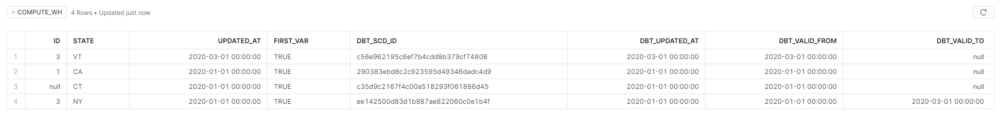

# Learning how dbt works
____
### Fist steps

First you'll have to install dbt, so go to the terminal e run this command

``` Shell
pip install dbt
```

Then you go to terminal again and run this to initialize the dbt folder

``` Shell
dbt init <name of it>
```

### The test that we're going to do it is on Snowflake database.

You can find de configuration [here.](https://docs.getdbt.com/reference/warehouse-profiles/snowflake-profile)

### Create your triall account on Snowflake
Once you've created your account, first things first, alter the role to accountadmin and create a DW on Warehouses setup.
After you've created with the configuration that you need, let's set the auto suspend time so we'll not be charged for inactivity time.

So, go to worksheets tab and run this code to set for 60 seconds.
``` SQL
ALTER WAREHOUSE "TRANSFORM_DW" SET WAREHOUSE_SIZE = 'XSMALL' AUTO_SUSPEND = 60 AUTO_RESUME = TRUE MIN_CLUSTER_COUNT = 1 MAX_CLUSTER_COUNT = 2 SCALING_POLICY = 'STANDARD' COMMENT = '';
```

### Now let's setup the dbt profile to connect on Snowflake
Go to the terminal and to see how your profile is set, run this to get the location of yml file:

``` Shell
dbt debug --config-dir

```

After that you can  open the file right in vs code, so type that and... tah dah

``` Shell
code <location of the file>\profiles.yml

```

You'll have to get the confgiration exemple given on link above and create your custom profiles file, like this bellow:

``` YML
my-test-snowflake:
  target: dev
  outputs:
    dev:
      type: snowflake
      account: ej24830.us-east-2

      # User/password auth
      user: dbt_test
      password: dbtT3st101

      role: test_role
      database: analytics
      warehouse: transform_dw
      schema: dbt
      threads: 1
      client_session_keep_alive: False

```
> See that account set is the sub domain on your url. To fill the config file you'll have to create some things on snowflake:
>- Use a new user just for dbt, you can create on account tab;
>- Don't forget to crete a specific role as >well on same tab;
>- Create a Database and grant privileges on the role that you've created;
>- Create a schema by running this command on snowflake worksheets: `create schema analytics.dbt;`

### Now we'll have to set the `dbt_project.yml` with some informations. Most the name, profile options and models on file end. Notice that the profile config we have to set with the name of the profile.yml that we've setted before.

After we get all this setup, we can go to the terminal and run de debug command to check if connection is working fine.

``` Shell
dbt debug
```

Then we gotta be shure that our user has all the permissions, so we can run that in snowflake:
``` SQL
grant create schema on database analytics to role test_role;
grant usage on all schemas in database analytics to role test_role;
grant usage on future schemas in database analytics to role test_role;
grant select on all tables in database analytics to role test_role;
grant create on all tables in database analytics to role test_role;
grant select on future tables in database analytics to role test_role;
grant select on all views in database analytics to role test_role;
grant select on future views in database analytics to role test_role;
GRANT USAGE ON WAREHOUSE TRANSFORM_DW TO ROLE test_role;
grant create on all tables in database analytics to role test_role;
grant IMPORTED PRIVILEGES on database SNOWFLAKE_SAMPLE_DATA to role test_role; 
```
____
### After all that we can start to create models
So, basically we have in dbt_project.yml file a place to set the directory to put models and by default we have the `example` folder.

To create a simple table we can use this sintaxe:

``` YML
{{ config(materialized='table') }}

select ...
```

To create a view:

``` YML
{{ config(materialized='view') }}

select ...
```

To create an incremental table, we'll have to declare a unique key to be referenced to do the trick:

``` YML
{{ config(materialized='incremental', unique_key='<field name>') }}

select ...
```
> But that's not all. We'll need and conditional statement like this:

``` YML

    and <field> (select max(<field>) from {{ this}})


```

Also we can create an ephemeral model, who's like a temp table. But the advantages is that we can use the logic of ref to uses as a pipeline.

To create a view:

``` YML
{{ config(materialized='ephemeral') }}

select ...
```
## Another parameters:
### Now let's talk about aliases.
DBT provides a parameter called alias, when we use that, the name of the table on the db will be the alias definied and not the name of the SQL file.

Use something like this:

``` YML
{{ config(materialized='table', alias='name_of_table') }}

select ...
```

### Let's set a schema

We can also set a schema, see bellow:

``` YML
{{ config(materialized='table', alias='name_of_table', schema='name_of_schema') }}

select ...
```
> You can do that without create a schema on database

### Let's set a database

We can also set a database, see bellow:

``` YML
{{ config(materialized='table', alias='name_of_table', database='name_of_database') }}

select ...
```
> You can't do that without create a schema on database. So create the database first on SGBD and give all priveleges that we need, before we can run the model

## Advanced configuration

Now let's add some variables to our dbt project.

Go to the bottom of `dbt_project.yml` file and let's set the variables.

We'll have something like this:

``` YML

# Configuring models
# Full documentation: https://docs.getdbt.com/docs/configuring-models

# In this example config, we tell dbt to build all models in the example/ directory
# as tables. These settings can be overridden in the individual model files
# using the `{{ config(...) }}` macro.
models:
  test_project:
    # Config indicated by + and applies to all files under models/example/
    example:
      +materialized: view

```

And now we're going to add a `vars` statement before models statement to declare our variables and the file will be like this

``` YML

vars:
  my_first_var: True
  my_second_var: 2020
  my_third_var: 2


# Configuring models
# Full documentation: https://docs.getdbt.com/docs/configuring-models

# In this example config, we tell dbt to build all models in the example/ directory
# as tables. These settings can be overridden in the individual model files
# using the `{{ config(...) }}` macro.
models:
  test_project:
    # Config indicated by + and applies to all files under models/example/
    example:
      +materialized: table
```
> as we se above, we can also change the default materialization type to table. So, if the model is not definied will be table.

#
## Tests

 To do the tests, we have run the command bellow and than we'll have all the tests that we've configured on `schema.yml` file. But the tests will be running on our bases, so if we want to run the tests, make sure that our models already ran before we do the testing part.

 ### We have some types of tests:

 ### Unique

 To verify and attest if values from a column are unique just do like this:

 
``` YML

models:
  - name: my_first_dbt_model # name of sql file
    description: "A starter dbt model" 
    columns: 
      - name: id # declare the name of column
        description: "The primary key for this table"
        tests:
          - unique # unique test like this
```

 ### Not Null

  To verify and attest if there are any null value in a column, just do like this:

 
``` YML

models:
  - name: my_first_dbt_model # name of sql file
    description: "A starter dbt model" 
    columns: 
      - name: id # declare the name of column
        description: "The primary key for this table"
        tests:
          - not_null # not null test like this
```

To test if a field object is in a specific value:

 
``` YML

models:
  - name: my_first_dbt_model # name of sql file
    description: "A starter dbt model" 
    columns: 
      - name: id # declare the name of column
        description: "The primary key for this table"
        tests:
          - accepted_values: # accepted values test like this
              values: [1,2] 
              quote: false
```
> The declaration of `quote` parameter will ensure that the value will be just like we wrote and not a string.


## Testing Models relationship

Fist we have to create a relationship.

We can use the `ref` function to query on another models, so if we have a model called "sales_incomes", we can create another model from it. Let's create a model who brings only sales from Brazil, to create a dataset for this region. The sintax model would be like this:

``` SQL

select *
from {{ ref('sales_incomes')}}
where country = 'Brazil'

```

Now we can test this relationship by doing this on `schema.yml` file:

``` YML
# first the origin table
models:
  - name: sales_incomes # name of sql file
    description: "A starter dbt model" 
    columns: 
      - name: id # declare the name of column
        description: "The primary key for this table"
        tests:
          - not_null

# Now the ref table

models:
  - name: sales_incomes_brazil 
    description: "A starter dbt model" 
    columns: 
      - name: id # declare the name of column
        description: "The primary key for this table"
        tests:
          - not_null
          - relationships
              to: ref('sales_incomes')
              field: sales_id
```
> This means that sales_id field on second model needs to refers on first model. So if there is any id on second whos not on first, we'll receive an error by testing it.

## Custom tests

To do an exemple of a custom test, we have to go on `tests` folder and create a new sql file.
On this case we are going to check if there are any rows returning, and we get some rows the test will fail.

If we want to test if the table returns more than 10% of null values on a field, we can put a SQL file like this on tests folder:

``` SQL
-- this query will verify the percentage of null values on a field table


SELECT
    sum(case when id is null then 1 else 0 end) / count(*) as total_nulls
FROM {{ref('test_first_dbt_model')}}

having sum(case when id is null then 1 else 0 end) / count(*) <= 0.1

```

## Some tips

We can also run only one model at the time or run all directory, by doing this on terminal:

``` Shell
dbt run --models dates_inc

```
>By doing this we'll get all models with that name on run


``` Shell
dbt run --models dbt-examples

```
>By doing this we'll get all models in this directory on run


``` Shell
dbt run --models dbt-examples.dates_inc

```
>By doing this we'll specify the model that we want to run. And we can run more than one by specifying the name.

## Hooks

We can run some custom code before or after a model is run, and we can do this on `dbt_project.yml` file or directly on the model parameter, in model file.

### Post-run hooks
On `dbt_project.yml` file, we can do this to run some sql commands after the model is run:

``` YML	
models:
  test_project:
    # Config indicated by + and applies to all files under models/example/
    example:
      +materialized: table
      post-hook: 'grant usage on schema {{target.this}} to role analyst'
```
> Note that we can use the `{{target.this}}` macro to get the name of the schema that will be created. This is useful when we want to grant usage on a schema. And the place that we put the parameter its on the model hierarchy.

We can also do this on the model file:
``` YML
{{ config(materialized='incremental', unique_key='d_date'), post_hook='grant select on {{this}} to role analyst' }}

select *
from "SNOWFLAKE_SAMPLE_DATA"."TPCDS_SF10TCL"."DATE_DIM"
where d_date <= current_date


    and d_date > (select max(d_date) from {{ this }})

```

### Before-run hooks
We can make a case to run some sql commands before the model is run and use it to get track on some informations.

To do this, we can do this on `dbt_project.yml` file:

``` YML	

target-path: "target"  # directory which will store compiled SQL files
clean-targets:         # directories to be removed by `dbt clean`
  - "target"
  - "dbt_modules"

on-run-end:
  - 'grant usage on schema analytics.dbt to role analyst'
  - 'grant select on all tables in schema analytics.dbt to role analyst'
  - 'grant select on all views in schema analytics.dbt to role analyst'
on-run-start:
  # - 'USE WAREHOUSE transform_dw'
  - 'create table if not exists dbt.audit (model text, state text, time timestamp_ltz)'

vars:
  my_first_var: True
  my_second_var: 2020
  my_third_var: 1
```
> See the `on-run-end` and `on-run-start` section. 

We can use like this to:

``` YML
models:
  test_project:
    # Config indicated by + and applies to all files under models/example/
    example:
      +materialized: table
      post-hook: 'grant usage on schema {{target.this}} to role analyst'
  pre-hook: "insert into dbt.audit (model, state, time) values ('{{this.name}}', 'starting model deployment', current_timestamp)"
```
> Note that we can use the `{{this.name}}` macro to get the name of the model that will be run.
>   - pre-hook: executed before a model, seed or snapshot is built.
>   - post-hook: executed after a model, seed or snapshot is built.
>   - on-run-start: executed at the start of dbt run, dbt seed or dbt snapshot
>   - on-run-end: executed at the end of dbt run, dbt seed or dbt snapshot 

## Snapshots

To create a snapshot we have to create a sql file on `snapshots` folder.
The snapshots seems like this:
``` SQL	

    {{
        config(
            target_database='analytics',
            target_schema='snapshots',
            unique_key='id',
            strategy='timestamp',
            updated_at='updated_at',
        )
    }}
    select * from {{ref('my_first_dbt_model')}}
    

```
> The rule of thumb here, is create a snapshot from a source model.

Snapshots will create a track of data change, by creating a structure similar to a SCD II. 
See bellow:


## Sources
A source is a model that we declare as a source to simplify the development of models and data flows.
We declare sources on `schema.yml` file. In the bottom of this file we have a list of sources.

``` YML	
sources:
  - name: example_source
    database: snowflake_sample_data  
    schema: tpch_sf1
    tables:
      - name : customer
        columns:
          - name: c_custkey
            tests:
              - not_null
              - unique
      - name : orders
```
> Note that we can put tests on columns.

To run only sources, we can do this on terminal:
``` Shell
dbt run --models source:example_source+
```

## Macros

Macros are a better way to transform data in your project. We can transform data using SQL? Of course we can.
But we can use a lot of benefits and gain performance just by using macros.

For exemple, here is a macro that will group data by ``N`` fields:

``` SQL

    GROUP BY
        
            {{ i }}
            , 
        

```
> To use that, we need to create a sql file on `macros` folder, by doing this we can reference this macro on our models, like this:

``` SQL
{{ config(materialized='table') }}


SELECT
    c.c_custkey,
    c.c_name,
    c.c_nationkey as nation,
    sum(o.o_totalprice) as total_order_price
from  {{ source('example_source', 'customer') }} c
LEFT JOIN {{ source('example_source', 'orders') }} o
ON c.c_custkey = o.o_custkey

{{group_by(3)}}
```
> Note that we can use the `{{group_by(3)}}` macro to group data by 3 fields.

## Tags

Tags are a way to group models and data flows to better organize your project. You can use it to tag a models folder to specify that this models are runnig daily, weekly, monthly, etc.

To do this, we can do this on `dbt_project.yml` file:

``` YML	
models:
  test_project:
    # Config indicated by + and applies to all files under models/example/
    example:
      +materialized: table
      tags: "daily"

    new:
      +materialized: view
      tags: "hourly"
```
> By doing this, we can run only models tagged with `daily` or `hourly` tag.

But this may not be the best way to organize your project. You can also use tags for each model. Because if we tag a whole folder, we can run only models tagged with `daily` or `hourly` without having a context organization.
So let's tag a model directly:

``` SQL	
{{ config(materialized='table', alias='first_model', tags="daily") }}

with source_data as (

    select 1 as id, 'CA' as state, '2020-01-01 00:00:00'::timestamp as updated_at
    union all
    select null as id, 'CT' as state, '2020-01-01 00:00:00'::timestamp as updated_at
    union all
    select 3 as id, 'VT' as state, '2020-03-01 00:00:00'::timestamp as updated_at
)

select *, {{var('my_first_var')}} as first_var
from source_data
```
> By doing this, we can run only models tagged with `daily` or `hourly` tag.

To run models by tag, we can do this on terminal:
``` Shell
dbt run --model tag:daily
```
It is possible to include multiple tags on models, so you need to create a list of tags:

``` SQL	
{{ config(materialized='table', alias='first_model', tags=["daily","region"]) }}

with source_data as (
...
```
## Limiting data to get faster run on development only in local environment
We can use jinja to do it, so let's get a model to run only on development environment:

``` SQL	
{{ config(materialized='table') }}

select 
    distinct o_orderdate,
    sum(O_TOTALPRICE) over (order by o_orderdate asc) as total_sales
from "SNOWFLAKE_SAMPLE_DATA"."TPCH_SF1"."ORDERS"


where year(o_orderdate) = 2018



order by o_orderdate asc
```
> See that we use the `` tag to limit data to run only on development environment.
